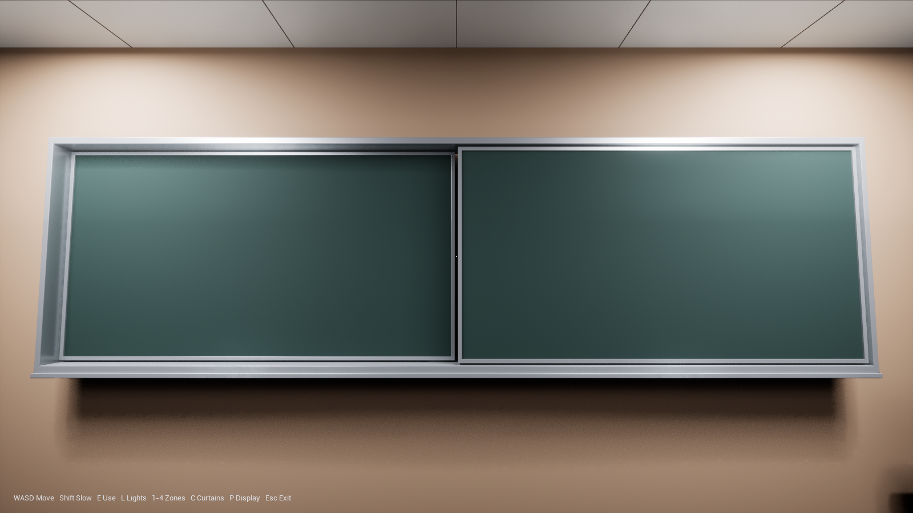
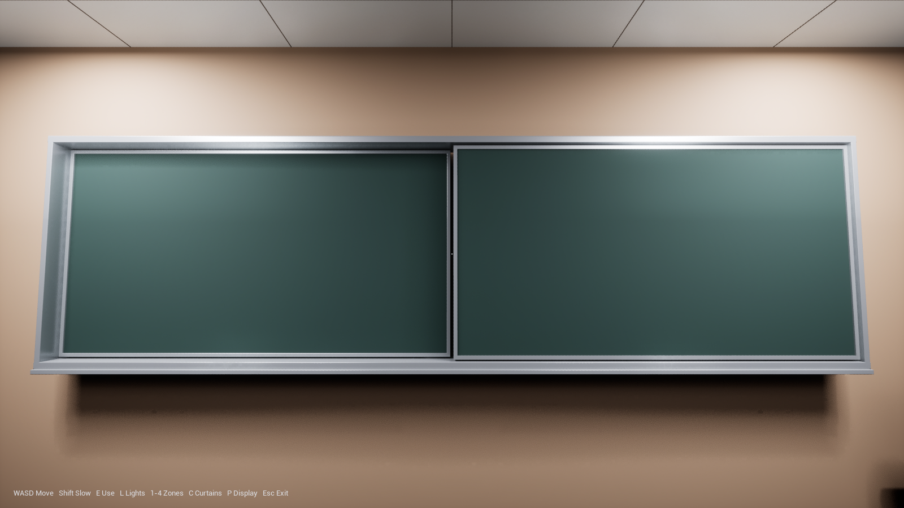

# Sliding teaching display — validation, 2026-09-09

## Corrected arrangement

Left and right are defined from a visitor **facing the teaching wall**. The screen stays behind the original right board. That board slides left, in front of the stationary left board, to expose the screen on the right. It returns on power-off. This follows the user's on-site clarification, not an inference from the photographs.

Current provisional dimensions are 2.64 × 1.42 m per board, 2.66 m horizontal travel, 11 cm between board centre planes, and a 2-second full travel. The screen is 2.50 × 1.34 m. These are editable `TEACHING_*` parameters in the main Blender generator; they are not measured specifications. Automatic power/movement linking is a prototype convenience, not a claim that the real board is motorized.

## Implementation and checks

- The moving board and its four frame edges are independent objects, excluded from the static classroom runtime export.
- The screen, its text, and its local light stay at the right-hand position; no central overlay remains.
- Only the outer uprights are fixed. There is no fixed centre divider obstructing the opening.
- Power is requested with P or the lectern's E controller. Light and text activate only once the board is fully open. Power-off extinguishes them immediately, before the return movement.
- Reversing during travel continues from the current position. Camera adaptation follows actual screen illumination, not just the requested power state.
- The provisional standby light is also behind the right board and casts shadows, rather than illuminating a separate location through the closed board.
- Blender's scene property `teaching_board_open` controls the same closed/open geometry. The runtime exporter generates `HumanityTrinityRebuildTeachingLayout.h` from that scene, including the moving frame pieces.

Validation results:

| Check | Result |
|---|---|
| Blender driver: closed → half → open → partial reverse → closed | PASS |
| Unreal C++ build and explicit asset `SETUP_COMPLETE` | PASS |
| Initial screen covered at centre and eight near-edge sample points | PASS |
| Actual player-view E trace hits the lectern controller | PASS |
| Mid-travel reversal without teleporting or premature illumination | PASS |
| Right-hand screen exposed at all nine sample points; board at left overlap endpoint | PASS |
| Power-off immediately removes screen illumination | PASS |
| Board returns to its original position and covers all nine sample points | PASS |
| Full lighting, adaptation, curtain, tabletop-ceiling, and both prop-door regression sequence | PASS |

The full test ends with `[HUMANITY_TRINITY_REBUILD_SELFTEST] PASS`. Board-specific log markers are `BOARD_INITIAL_CLOSED`, `BOARD_MID_TRAVEL_REVERSE`, `BOARD_REVEAL_RIGHT_SCREEN`, and `BOARD_RETURN_AND_OCCLUDE`. These are geometry/interaction checks, not photometric measurements.

## Same-viewpoint captures

Closed:



Open, with the original right board stacked over the left and the screen exposed on the right:


Returned after power-off:



## Reproduce

Regenerate the Blender model, export the runtime GLB, and run the build/import script as described in the main README. Then launch the walkthrough map with:

```text
UnrealEditor-Cmd.exe UnrealProject/HumanityTrinityRebuild.uproject /Game/HumanityTrinityRebuild/Maps/L_HumanityTrinityRebuildWalkthrough -game -RenderOffscreen -ResX=1600 -ResY=900 -unattended -nosound -HumanityTrinityRebuildSelfTest -HumanityTrinityRebuildCapture -log
```

Inspect `UnrealProject/Saved/Logs/HumanityTrinityRebuild.log` for the explicit final PASS; an exit code alone is insufficient. Screenshots are generated under `UnrealProject/Saved/Screenshots/HumanityTrinityRebuild`.
