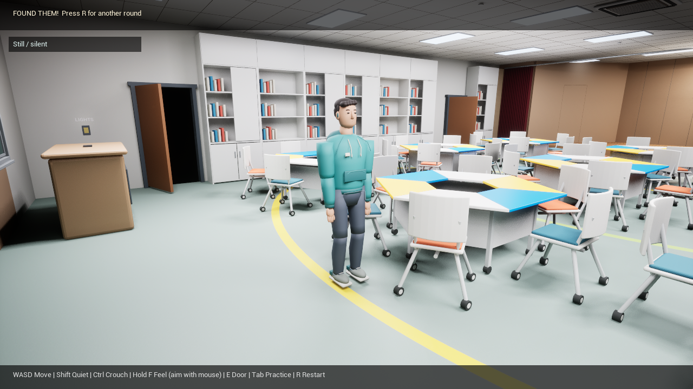
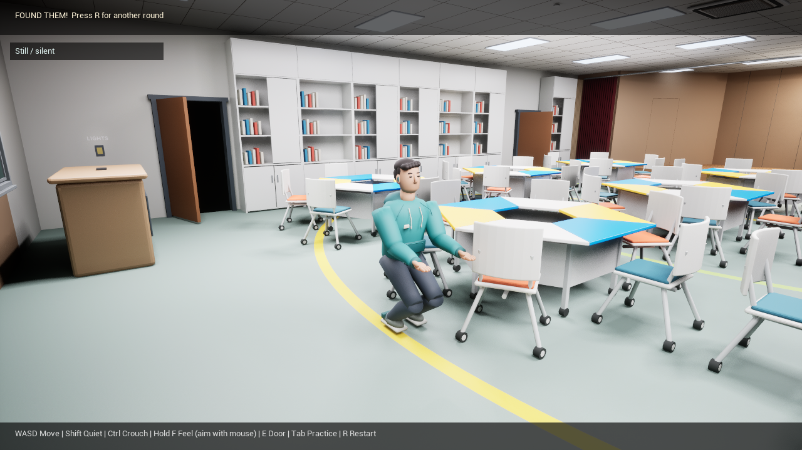
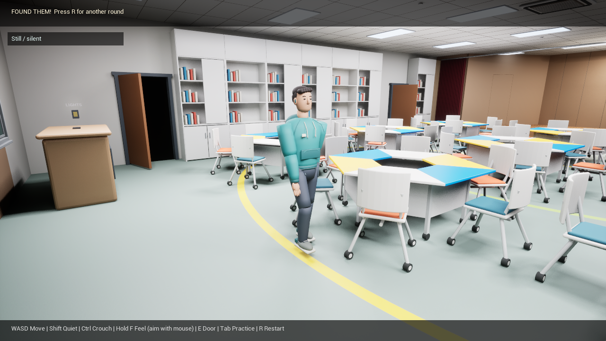

# Character and hiding behavior validation

Validated in Unreal Engine 5.7 on Windows, 2026-09-23.

## Delivered assets and behavior

- Original editable civilian model: `Assets/Hider/Trinity_Hider.blend`.
- Nine joint-local GLBs, assembled into fifteen moving segments in Unreal.
- Shaped clothing, hood, pocket, drawstrings, facial features, hair, fingers and sneakers.
- Standing/breathing, listening, two-link leg animation for walking and crouching.
- Collision-tested classroom navigation: 243 reachable nodes and 9 separated covers in the current layout.
- Sound-driven state changes and remembered noise positions; no continuous seeker-location tracking.
- Distance-based player and hider footsteps, quiet walking, crouching and material-aware hand contact.
- Bright practice and full blackout rounds, with restart and timeout transitions.

## Runtime evidence

The full selected game log is in [HideAndSeekCharacterRuntime.txt](HideAndSeekCharacterRuntime.txt).

| Check | Observed result |
|---|---|
| Character mesh loading | 15 / 15 segments loaded |
| Quiet nearby player | No unsolicited AI movement or hearing event |
| Player and hider crouch | PASS |
| Quiet sound at 220 cm | Not heard |
| Normal sound at 180 cm | Heard; listening precedes escape |
| Route traversal | 35 nodes, about 983 cm net displacement, 31 footsteps, settled at cover |
| Hand obstructed by a physical barrier | Barrier hit at about 31 cm; no catch |
| Same reach after removing the barrier | Actual posed character mesh hit; seeker wins |
| Real player movement | Distance-based footstep heard by hider |
| Practice restart | Main lights on, fresh round |
| Timer expiry | Hider wins |
| Switch back to darkness | Fresh preparation state |
| Overall | `[HIDE_AND_SEEK_SELFTEST] PASS` |

Rendered screenshots were inspected for character scale, materials, ground contact,
standing/walking/crouching poses, HUD readability and blackout. The blackout view
shows only the timer, the player's own movement status, hand-contact text when
present, and controls. AI behavior text is restricted to bright practice.







## Walkthrough regression

[HideAndSeekWalkthroughRegression.txt](HideAndSeekWalkthroughRegression.txt) records
the original walkthrough self-test. Light-switch interaction, curtains, display
motion and occlusion, both prop-room doors, stepped traversal and closed-door
blocking passed; overall `[HUMANITY_TRINITY_REBUILD_SELFTEST] PASS`.

## Reproduce

Build the editor module, then run:

```powershell
& 'D:\EpicGames\UE_5.7\Engine\Binaries\Win64\UnrealEditor-Cmd.exe' `
  '.\UnrealProject\HumanityTrinityRebuild.uproject' `
  '/Game/HumanityTrinityRebuild/Maps/L_HumanityTrinityRebuildHideAndSeek' `
  -game -RenderOffscreen -ResX=1280 -ResY=720 -unattended -nosound `
  -HideAndSeekSelfTest -HideAndSeekCapture -log
```

Inspect the final log marker, not just the process exit code. These runs validate
audio asset loading and footstep/hearing events; `-nosound` does not validate the
perceived quality of playback through a particular pair of headphones.

## Scope

One AI hider on the flat classroom floor. Routes do not include stage steps,
prop-room interiors, climbing or crawling under tables. Crouching beside furniture
changes the pose and capsule height; hand detection uses the articulated meshes.
Locomotion uses a swept capsule, so limb clearance is an approximation. Jointed
static meshes are editable and lightweight, with more stylized joints than a
skinned character. Multiplayer, visible first-person hands and physical haptics
remain future work.
