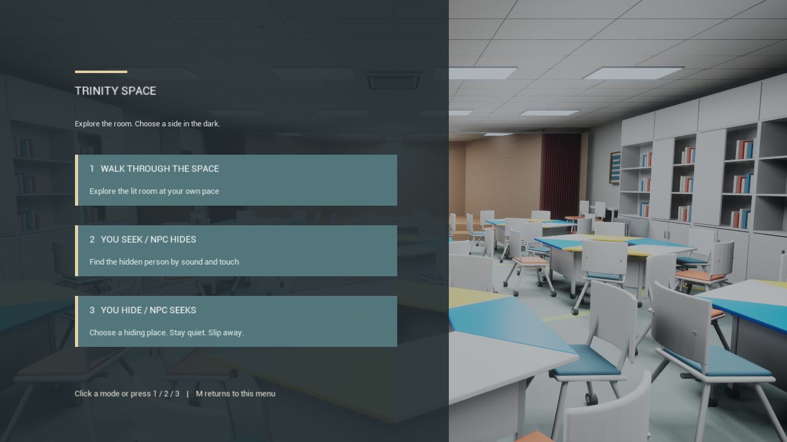

# One-window mode selection

Originally validated on Windows with Unreal Engine 5.7 on 2026-09-23;
the third mode and its desktop transitions were validated on 2026-09-25.

The existing `Humanity Trinity Space.lnk` desktop shortcut was installed with
`Tools/Windows/install_humanity_trinity_desktop_shortcut.ps1`. Its saved target
is `D:\HumanityTrinityRebuild\Launch_HumanityTrinityRebuild.cmd`, which launches
`L_HumanityTrinityRebuildModeMenu` in game mode.

The mode menu is drawn over the classroom, so the room is visible before a mode
is selected. The three buttons accept a mouse click or keys `1`, `2` and `3`:
walkthrough, player seeking, and player hiding. The third option and its
role-specific runtime checks are recorded in [PlayerHiding.md](PlayerHiding.md).

## Runtime checks

- The menu's automated walkthrough selection stayed in the same world and
  reported `walkthrough=PASS`.
- The automated hide-and-seek selection loaded the hide-and-seek game mode in
  the same process; the dark round and game self-test finished with `PASS`.
- The actual desktop shortcut opened the menu in one game window. In that same
  process and window handle, key `1` selected walkthrough, `M` returned to the
  menu, key `2` selected hide-and-seek, and `M` loaded the menu again.
- A mouse click on the walkthrough card selected walkthrough in the running
  window. The window was left open on the mode menu for the user.

Selected automated and live-window log lines are in
[ModeMenuTransition.txt](ModeMenuTransition.txt) and
[ModeMenuLiveWindow.txt](ModeMenuLiveWindow.txt).

The original walkthrough and hide-and-seek maps remain directly launchable for
development. The desktop shortcut launches their shared mode-selection entry.
