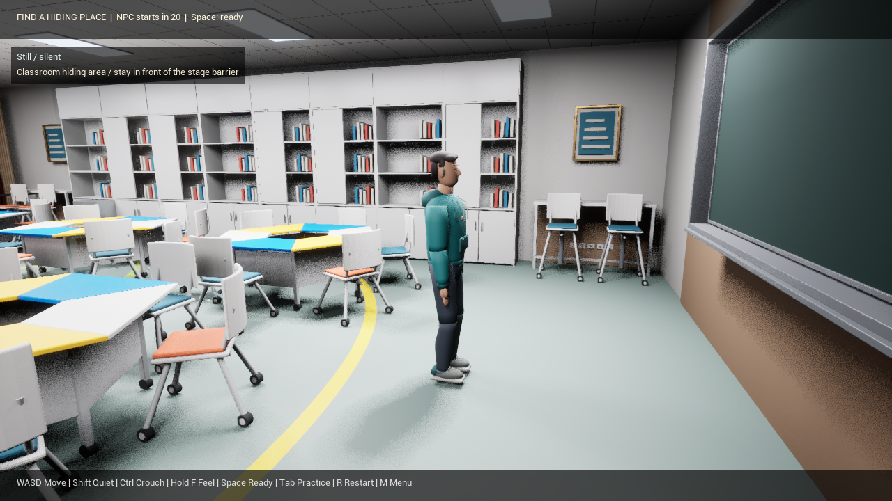
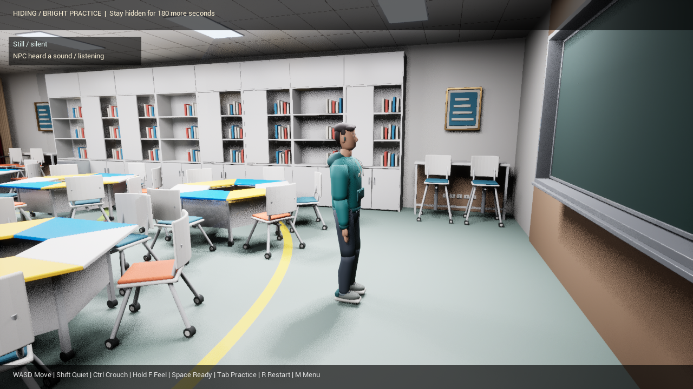
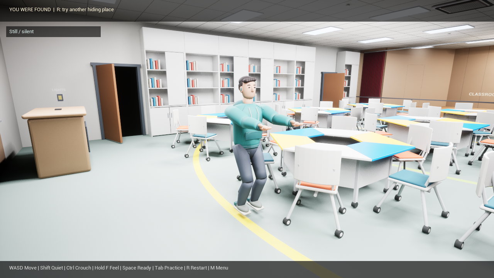

# Player hides / NPC seeks

Validated on Windows with Unreal Engine 5.7 on 2026-09-25.

The existing **Humanity Trinity Space** desktop shortcut opens the shared
classroom menu. Choose **3 — You hide / NPC seeks** with the mouse or keyboard.
The menu passes `Role=Hider` to the hide-and-seek map in the same game window.
Walkthrough and player-seeking remain options 1 and 2.

## Playable loop

- Twenty lit seconds to find a hiding place. The NPC faces the teaching wall
  and ignores sound during preparation. **Space** starts the search early.
- Survive a three-minute dark search. Normal movement produces audible steps;
  **Shift** quiet walking and **Ctrl** crouching reduce their range. Standing
  still produces no footsteps. **F** feels for nearby surfaces.
- The NPC patrols floor and furniture areas, remembers approximate audible
  positions, investigates them, and turns/reaches/crouches to inspect nearby
  places. Silent movement does not reveal a new position.
- A short physical hand sweep must reach the player's standing or crouched
  capsule. Furniture and walls block that sweep. Touching the NPC with **F**
  also reveals the player. Being found loses; surviving the timer wins.
- Both results restore the lights. **R** restarts the current role; **Tab**
  restarts that role in bright practice; **M** returns to the shared menu.








## Automated runtime results

The final player-hiding run reported **`[PLAYER_HIDING_SELFTEST] PASS`**.
Selected runtime evidence is in [PlayerHidingRuntime.txt](PlayerHidingRuntime.txt).

| Area | Verified result |
| --- | --- |
| Entry and preparation | Actual menu selection reaches the hiding role; 20-second preparation; one 15-part NPC with a loaded footstep asset; waiting NPC ignores noise |
| Navigation and area | Stage boundary blocks access; graph built after room collision loads; 309 reachable nodes and 8 cover candidates |
| Round start | Ready action cancels preparation timer and starts the search; main and residual lights are off |
| Fair perception | Silent player does not change patrol or sound memory; quiet steps outside range are ignored; obstruction attenuates sound |
| Sound response | Audible event triggers listening; NPC investigates the remembered sound after the player moves elsewhere |
| Movement | 37-node investigation route; approximately 1,539 cm of observed travel and 36 emitted footsteps; reaches the sound area and starts inspection |
| Capture | Wall blocks a catch; unobstructed contact with a crouched player ends the round as a loss |
| Controls and results | Bright restart retains role and lights; actual movement input produces heard footsteps; timer expiry wins; dark restart resets state and creates exactly one NPC |

The original player-seeking regression also reported
**`[HIDE_AND_SEEK_SELFTEST] PASS`**. It covered quiet proximity, crouching,
hearing range, escape navigation, distance-based footsteps, touch obstruction,
successful catch, practice/restart, and timeout. Evidence is in
[PlayerHidingSeekingRegression.txt](PlayerHidingSeekingRegression.txt).

The tests use a fixed random seed. During isolated sound/navigation checks the
player is moved away from the NPC's route so an incidental valid catch does not
end the test early. Contact is then tested explicitly with and without a wall.
Timer expiry is accelerated to verify the result transition. Audio asset
loading and emitted events are checked with `-nosound`; headphone playback
quality is not established by these automated checks.

## Desktop interaction

The installed shortcut still targets `Launch_HumanityTrinityRebuild.cmd`.
The visible game window was used to check keyboard and mouse mode selection,
Space to start early, Tab for bright practice, and M to return to the menu.
Walkthrough was also selected and returned to the menu in the same window.
Observed actions and selected logs are in
[PlayerHidingLiveWindow.txt](PlayerHidingLiveWindow.txt).

Entering hide-and-seek explicitly restores game input and captured mouse look
after leaving the menu. Light-state debug messages are suppressed during
gameplay so they do not overlap the round interface. The existing VSM warning
suppression remains in place.

## Reproduce

Build the editor target first:

```powershell
& 'D:\EpicGames\UE_5.7\Engine\Build\BatchFiles\Build.bat' `
  HumanityTrinityRebuildEditor Win64 Development `
  '-Project=D:\HumanityTrinityRebuild\UnrealProject\HumanityTrinityRebuild.uproject' `
  -WaitMutex -NoHotReloadFromIDE
```

Run the new role through the shared menu:

```powershell
& 'D:\EpicGames\UE_5.7\Engine\Binaries\Win64\UnrealEditor-Cmd.exe' `
  'D:\HumanityTrinityRebuild\UnrealProject\HumanityTrinityRebuild.uproject' `
  '/Game/HumanityTrinityRebuild/Maps/L_HumanityTrinityRebuildModeMenu' `
  -game -RenderOffscreen -ResX=1280 -ResY=720 -unattended -nosound `
  -ModeMenuSelfTest=playerhide -PlayerHidingSelfTest -HideAndSeekCapture `
  '-abslog=D:\HumanityTrinityRebuild\UnrealProject\Saved\Logs\PlayerHidingFinal.log'
```

For the original role, replace the two self-test switches with
`-ModeMenuSelfTest=hide -HideAndSeekSelfTest` and use a different log file.
Check the final PASS marker, not just the process exit code. Direct development
entry to the hide-and-seek map also supports `-PlayerHides`.

## Current limits

This is a single-player prototype with one NPC. The hiding mode is restricted
to the classroom floor; a visible temporary rail at the stage marks and blocks
the boundary. Stage and prop-room searching, climbing, crawling under desks,
and multiplayer are not implemented. The searcher shares the existing
articulated model and procedural poses. Touch feedback uses brief material
descriptions; real haptics and first-person arms are not implemented.

The search graph uses standing body clearance. Furniture is treated as static
navigation geometry, with live collision checks during routing and movement.
This validates the current classroom layout, rather than arbitrary rearranged
furniture or a general-purpose navigation system.
