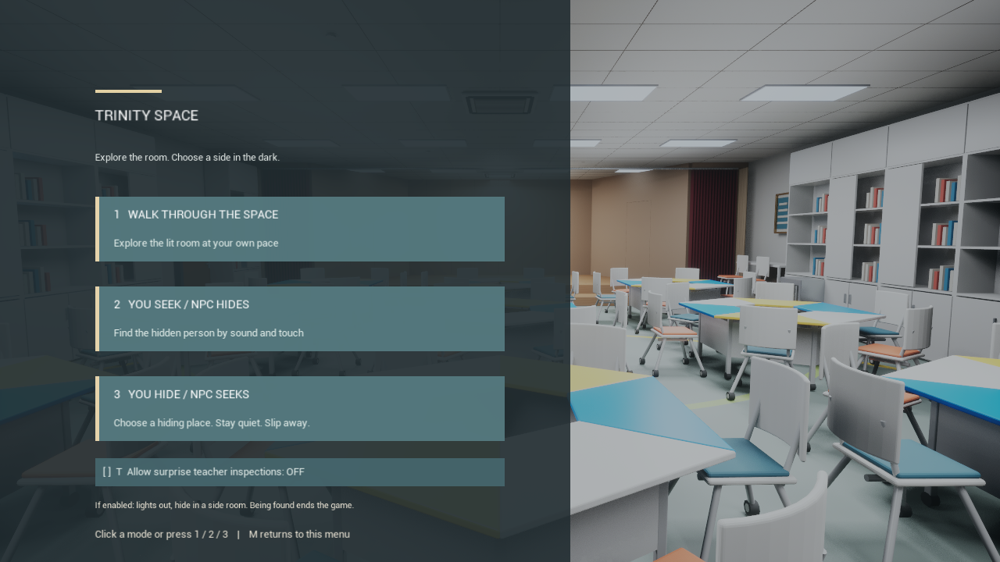
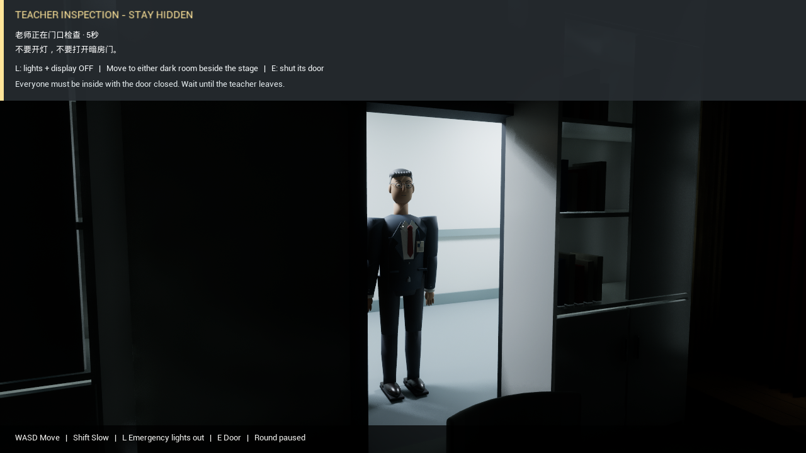

# Teacher patrol runtime validation

Validated on 2026-10-07 with Unreal Engine 5.7 in
`D:\Projects\HumanityTrinityRebuild`. The editor target was built, the changed
classroom GLB reimported, and all nine teacher meshes and five sound assets
imported before gameplay validation. The import emitted
`[TEACHER_PATROL_SETUP] COMPLETE environment=YES teacher=YES audio=YES`.

## Gameplay acceptance

The rendered `-game -RenderOffscreen` suite exercises ten separate runs:

| Run | Acceptance |
| --- | --- |
| `walk-safe` | Disabled by default, explicit opt-in, both closed dark rooms safe, stage unsafe, complete inspection and departure |
| `walk-auto` | Enabling the event schedules an automatic trigger; successful completion |
| `walk-exposed` | Player outside the closed dark rooms is discovered |
| `walk-lights` | Main classroom lighting causes discovery even with player hidden |
| `walk-screen` | Illuminated teaching display causes discovery |
| `walk-late` | Opening the hiding-room door during inspection causes discovery |
| `walk-exit` | Real production failure timer emits `FAILURE_EXIT` and closes the process after eight seconds |
| `seek-safe` | NPC hider walks to the left dark room and returns; original round pauses and resumes |
| `hide-safe` | NPC seeker walks from the front classroom to the right dark room and returns; original round pauses and resumes |
| `practice-safe` | Bright practice supports emergency blackout, safe hiding and normal resumption |

Every applicable run checks three initially closed exterior doors, actual
visibility obstruction at each doorway, four corridor fixtures, 15 loaded
teacher parts, all five loaded sound assets, and the actual action delegate
bound to L. Calling that delegate twice must leave both main lights and the
display off. Inspection and failure are real production state-machine paths.
The final exposed-player check also confirms that looking into the lit
corridor drives the real player camera to **-4.692 EV**, near the -4.7 EV
bright-adapted target, instead of overexposing the teacher.

The seeded final seeking run measured **1,938 cm** of NPC travel. The hiding
role measured **6,408 cm**: its searching NPC followed a 72-point route from
the front of the classroom, entered the right room in about 15 seconds, then
returned after the teacher left. The production warning lasts 24 seconds.
Neither path teleports the NPC; capsule sweeps, stage steps, door opening,
door closure and return movement run normally.

## Regression and visual evidence

The original seeking and player-hiding self-tests cover hearing, quiet
movement, obstacle occlusion, physical contact, practice, restart and round
expiry. The room tests cover lighting circuits, eye adaptation, curtains,
sliding teaching display, both prop-room doors, step traversal and closed-door
blocking. These regression runs use `-nullrhi`; the patrol suite and menu use
the actual renderer.

The menu self-test clicks the opt-in checkbox twice, verifies that the session
preference returns to its initial state, then selects walkthrough in the same
window. Initial menu state remains OFF.





The [warning image](../Previews/TeacherPatrol_walk_safe_Warning.png) and
inspection image use the same camera position and manual exposure. They show
the opaque closed door, then the revealed teacher, corridor floor/wall and
light on the jamb and nearby classroom furniture. The
[failure image](../Previews/TeacherPatrol_walk_exposed_Failed.png) records the
Chinese reason and exit countdown. Model/source identity checks are recorded
in [TeacherPatrolAssets.json](TeacherPatrolAssets.json).

## Reproduction

```powershell
$Project = Join-Path (Get-Location) 'UnrealProject\HumanityTrinityRebuild.uproject'
$Engine = 'D:\EpicGames\UE_5.7\Engine'
& "$Engine\Build\BatchFiles\Build.bat" HumanityTrinityRebuildEditor Win64 Development "-Project=$Project" -WaitMutex -NoHotReloadFromIDE
& "$Engine\Binaries\Win64\UnrealEditor-Cmd.exe" $Project "-ExecutePythonScript=$((Get-Location).Path)\Tools\Unreal\setup_teacher_patrol_unreal.py" -unattended -nop4 -nosplash -nullrhi
& .\Tools\Unreal\validate_teacher_patrol.ps1 -Capture
```

The full local logs live under `UnrealProject/Saved/Logs/TeacherPatrol-*.log`.
[TeacherPatrolRuntime.txt](TeacherPatrolRuntime.txt) preserves selected explicit
assertions, and [TeacherPatrolResults.json](TeacherPatrolResults.json) lists
the checked runs and log hashes. Successful process exit alone is not used as
proof; collection requires the final PASS markers and rejects failed assertions.

## Test boundaries

The tests position the player as a fixture to exercise both safe rooms and
failure cases; they do not claim an automated complete first-person escape
walkthrough. A separate spectator camera records the doorway while the actual
player remains hidden. NPC movement runs through production collision and
navigation without repositioning. Existing prop-door regression tests exercise
continuous player movement across the steps.

Automated runs use `-nosound`: they verify asset loading and event sequencing,
not subjective headphone balance. Speech is an offline fictional Chinese
teacher voice; footsteps and keys are reproducible synthesized effects.
No recording of a real teacher is used. The teacher checks the prescribed dark
rooms and light states; it does not enter the room for a general vision-based
search.
