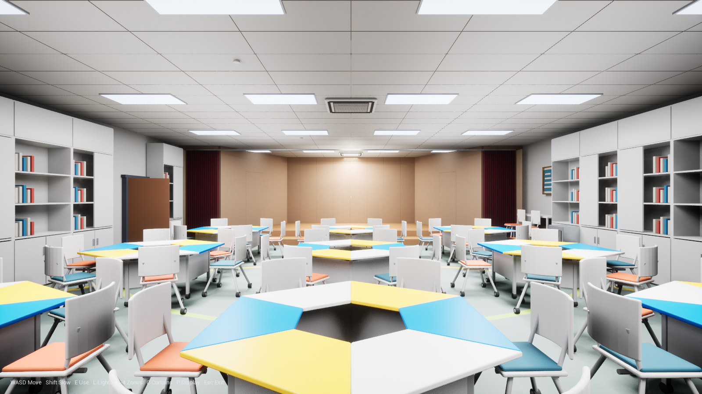
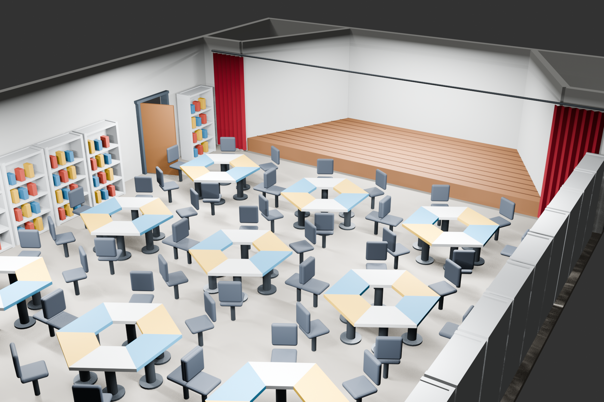
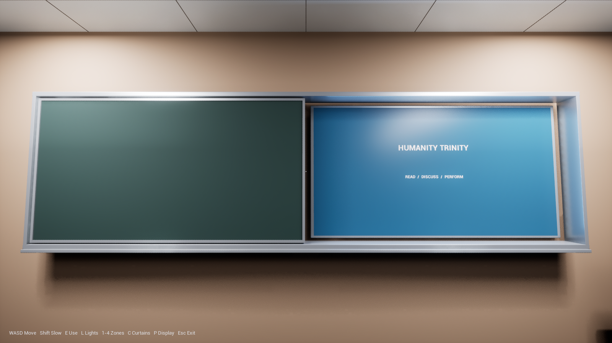
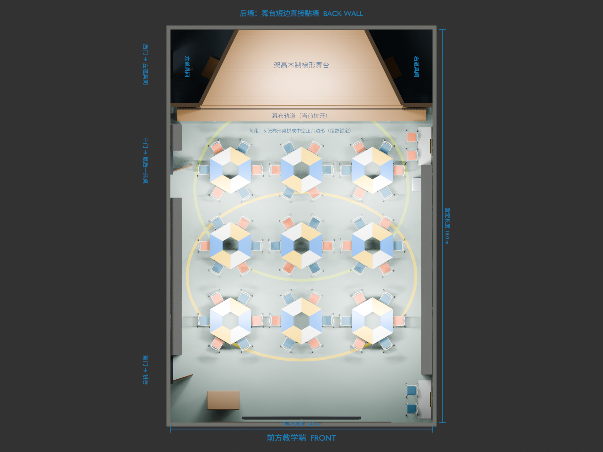
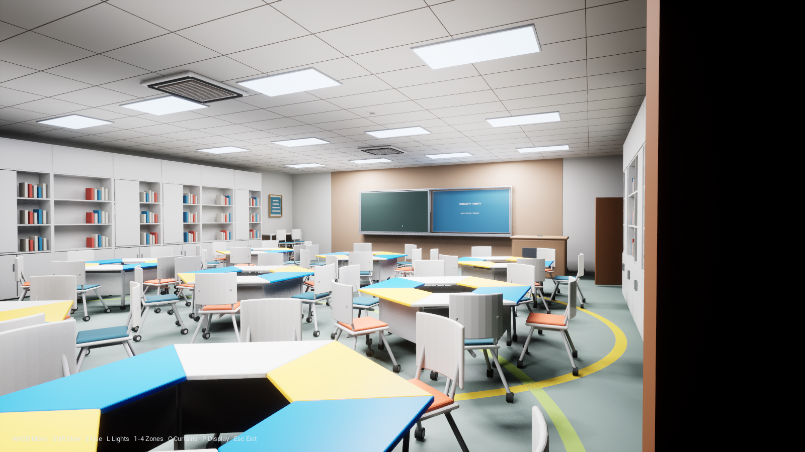

# HumanityTrinityRebuild

An editable Blender reconstruction and Unreal Engine interactive walkthrough of the **Humanity Trinity Space** (三一人文空间), located on B1 of Duzhi Building at the High School Affiliated to Fudan University.





## What is included

- Editable Blender source model and a parameterized Python generator.
- A general-purpose GLB export of the full editable scene.
- A merged runtime GLB for Unreal import.
- Photo-informed stage finishes, cabinetry, furniture, floor markings, ceiling details, and bar niches.
- Reproducible base-color and normal textures for wood, flooring, and curtain fabric, generated in code and usable outside Blender. The reference photographs themselves are not included or used as texture files.
- Unreal Engine 5.7 native C++ first-person movement and interaction.
- Twenty visible ceiling panels, synchronized with nine movable lights in four independently switchable zones.
- A wall-mounted light switch operated with a camera-center visibility trace.
- Animated curtain opening/closing and a separately switchable teaching display, with close-range controls.
- Two flush wooden doors in the sloping stage walls, opening into the prop rooms with E.
- Checked chair clearances and circuit-linked ceiling bounce for stable lighting when looking up from a tabletop.
- Slow dark adaptation and faster bright adaptation through manual exposure control.
- Directional door-leak and display-standby residual light assumptions for the almost-black state.
- Complex collision for the imported classroom, furniture, stage, shelves, and walls.
- Runtime self-test coverage for lighting, adaptation, player-view switch interaction, curtain movement, and the teaching display.

## Photo-informed refinement

The stage now has a broad lower tread and a higher main platform, pale oak-colored wood grain, warm wall panels and vertical slats, and burgundy folded curtains. The table area uses pale sage flooring with yellow/lime curved markings, saturated blue/yellow/off-white trapezoid tops, rounded white caster chairs with orange/blue seats, and tall white cupboards mixed with open shelves. Bar niches, outlets, framed decorative panels, a charging cabinet, ceiling joints, and cassette-style air-conditioning units add the details visible in the supplied photographs.

Facing the teaching wall, the display is fixed behind the right dark-green board. Turning it on slides that board left on a separate front track until it overlaps the stationary left board, then lights the exposed right-hand display. Turning it off extinguishes the display immediately and returns the board to cover it. This arrangement follows the user's on-site clarification; dimensions, travel time, and automated operation remain prototype assumptions. Curtains start open, and their animated controls do not establish a motorized installation on site.



Compare the same viewpoint with the boards [closed](Docs/Previews/HumanityTrinityRebuild_14_BoardClosed.png) and [returned after power-off](Docs/Previews/HumanityTrinityRebuild_16_BoardReturned.png).

The [sliding-display validation record](Docs/HumanityTrinityRebuild_TeachingDisplayValidation.md) describes the shared model parameters and runtime checks.

See [the photo-reference notes](Docs/HumanityTrinityRebuild_PhotoReferenceNotes.md) for the evidence/assumption boundary. In particular, the current nine table clusters and the two 21 cm stage rises remain editable approximations.

## Confirmed spatial relationships represented by the model

- A sealed, windowless rectangular basement classroom.
- Teaching wall, large display, and podium at the front.
- Central collaborative table area.
- Shelves and storage cabinets along both sides.
- Three doors on the left wall.
- Curtain between the table area and the stage.
- Raised wooden trapezoidal stage, with its long edge facing the classroom and its short edge touching the rear wall.
- Two enclosed triangular prop rooms occupying the corners left by the stage slopes.
- Each collaborative table cluster consists of six congruent trapezoid tables forming a hollow regular hexagon.

Unknown dimensions, fixture specifications, exact switch placement, light grouping, and residual-light sources remain explicitly provisional.

The complete scene is mirrored across the longitudinal centerline through the generator parameter `MIRROR_ACROSS_LONGITUDINAL_AXIS=True`. This records the corrected on-site orientation: when facing the rear stage, the three doors are on the left wall rather than the right.

## Quick start on Windows / 快速开始

The complete editable reconstruction before game development is preserved at
[v1.0.0-reconstruction](https://github.com/JunjieNian/HumanityTrinityRebuild/releases/tag/v1.0.0-reconstruction).

### Hide-and-seek / 黑暗捉迷藏

Run `Launch_HumanityTrinityRebuild_HideAndSeek.cmd`. You have 12 seconds to
memorize the lit room, followed by a three-minute search in complete darkness.
Use headphones: the hider's steps are spatialized and muffled by obstacles.
Press **Tab** to restart in bright practice mode and inspect the character,
learn the room, and observe the hider's current behavior.

- **WASD / mouse**: move and aim your hand, including looking down.
- **Shift**: careful, quieter steps. **Hold Ctrl**: crouch and move very quietly.
- **Hold F**: feel within one arm's reach while slowing down. Contact describes
  the material, height and distance; touching the actual posed body wins.
- **E**: operate a nearby prop door. **R**: restart. **Esc**: exit.

The original civilian character has a shaped hoodie with seams and drawstrings,
face and hair, hands with fingers, trousers and sneakers. Nine editable mesh
parts form fifteen animated body segments, with breathing, listening, walking
and a grounded crouch. The source is `Assets/Hider/Trinity_Hider.blend`.

The hider selects separated cover positions on a collision-checked classroom
navigation graph. It stays quiet until an audible footstep causes it to listen
and possibly relocate. Hearing uses distance, loudness and obstruction; the AI
only remembers the latest audible event. Its route avoids the remembered threat
and recent hiding places. Walking produces actual distance-based footstep events.
Practice mode exposes behavior text; dark rounds never expose AI state or location.

Current scope: one computer-controlled hider, classroom floor routes and crouching
beside furniture. This version has no multiplayer, crawling under tables, climbing,
skinned motion-capture animation, visible first-person hands, or haptic hardware.
Material touch descriptions are a sensory substitute; unrecognized materials use
a generic firm-surface description. The original walkthrough is available through
`Launch_HumanityTrinityRebuild_Walkthrough.cmd`.

To regenerate only the character, run the Blender generator, then the Unreal import
script after building the C++ module:

```powershell
& 'D:\Blender\blender-4.5.13-windows-x64\blender.exe' --background `
  --python '.\Tools\Blender\build_hider.py'
& 'D:\EpicGames\UE_5.7\Engine\Binaries\Win64\UnrealEditor-Cmd.exe' `
  '.\UnrealProject\HumanityTrinityRebuild.uproject' `
  '-ExecutePythonScript=D:\HumanityTrinityRebuild\Tools\Unreal\import_hider.py' `
  -unattended -nop4 -nosplash -nullrhi
```

The separate game map and original footstep can be regenerated with
`Tools/Audio/generate_footstep.py` and `Tools/Unreal/setup_hide_and_seek_unreal.py`.
The game self-test uses `-HideAndSeekSelfTest -HideAndSeekCapture`. It checks loaded
character parts, dark lighting, multiple reachable covers, silent proximity,
crouching, hearing range, route traversal, footsteps, touch occlusion and a real
catch, then captures three character poses. Logs and captures go to
`UnrealProject/Saved`; selected evidence is preserved under `Docs/Previews`.

Requirements:

- Unreal Engine 5.7.
- Visual Studio 2022 with the Desktop development with C++ and Game development with C++ workloads, if rebuilding the native module.
- Blender 4.5 LTS, if regenerating the model.

To enter the walkthrough directly, run:

```text
Launch_HumanityTrinityRebuild_Walkthrough.cmd
```

To create or refresh the branded desktop shortcut, run:

```powershell
powershell -ExecutionPolicy Bypass `
  -File '.\Tools\Windows\install_humanity_trinity_desktop_shortcut.ps1'
```

The shortcut uses the project launcher, the project folder as its working directory, and the multi-resolution icon stored under `Assets/Brand`.

To open the Unreal Editor project, run:

```text
Open_HumanityTrinityRebuild_UnrealProject.cmd
```

The launchers first use the `UE_ROOT` environment variable when it is defined, then check these common locations:

```text
D:\EpicGames\UE_5.7
C:\Program Files\Epic Games\UE_5.7
```

If Unreal is elsewhere, set `UE_ROOT` to the UE_5.7 directory before running the launcher.

## Controls

| Input | Action |
|---|---|
| W / A / S / D | Walk |
| Mouse | Look |
| Space | Jump |
| Shift (hold) | Walk slowly for close inspection |
| E | Use a nearby light switch, curtain, display control, or concealed prop-room door |
| L | Toggle all main lights from anywhere for comparison/debugging |
| C | Open/close the curtains smoothly |
| P | Toggle the teaching display |
| 1 | Toggle front teaching-zone lights |
| 2 | Toggle central table-zone lights |
| 3 | Toggle rear table-zone lights |
| 4 | Toggle stage-zone lights |
| Esc | Exit the standalone walkthrough |

## Repository layout

```text
HumanityTrinityRebuild.blend
HumanityTrinityRebuild.glb
HumanityTrinityRebuild_BlenderGenerator.py
HumanityTrinityRebuild_建模说明.md
HumanityTrinityRebuild_Unreal交互原型_使用说明.md
Assets/Textures/
Assets/Brand/
  HumanityTrinityRebuild.ico
  HumanityTrinityRebuild_Icon.png
Docs/
  HumanityTrinityRebuild_PhotoReferenceNotes.md
  Previews/
Tools/
  Blender/photo_details.py
  Blender/teaching_wall.py
  Blender/export_humanity_trinity_rebuild.py
  Unreal/build_and_setup_humanity_trinity_rebuild.ps1
  Unreal/setup_humanity_trinity_rebuild_unreal.py
UnrealProject/
  HumanityTrinityRebuild.uproject
  Config/
  Content/
  Source/HumanityTrinityRebuild/
```

Unreal-generated `Binaries`, `Intermediate`, `DerivedDataCache`, `Saved`, IDE state, logs, and Blender recovery files are intentionally excluded from Git.

## Regenerate the Blender model

The dimensions and layout parameters are grouped in the `P` dictionary near the top of `HumanityTrinityRebuild_BlenderGenerator.py`. Photo-informed detail generation is in `Tools/Blender/photo_details.py`; its reusable textures are stored in `Assets/Textures`. Keep these folders with the generator when moving the project.

```powershell
& 'D:\Blender\blender-4.5.13-windows-x64\blender.exe' `
  --background `
  --python '.\HumanityTrinityRebuild_BlenderGenerator.py'
```

This regenerates the `.blend`, full-scene `.glb`, texture assets, top view, and two perspective images. Geometry edits made only by hand in Blender will be replaced when the generator runs; preserve them separately or incorporate them into the source script first.

## Export the Unreal runtime mesh

```powershell
& 'D:\Blender\blender-4.5.13-windows-x64\blender.exe' `
  --background '.\HumanityTrinityRebuild.blend' `
  --python '.\Tools\Blender\export_humanity_trinity_rebuild.py'
```

The exporter excludes Blender-only lights, cameras, and annotations, combines the runtime geometry, verifies the room bounds, and writes:

```text
UnrealProject/Content/SourceAssets/HumanityTrinityRebuildEnvironment_Runtime.glb
```

## Rebuild and set up the Unreal project

```powershell
powershell -ExecutionPolicy Bypass `
  -File '.\Tools\Unreal\build_and_setup_humanity_trinity_rebuild.ps1'
```

The setup script compiles the native module, imports the runtime GLB and its materials, prepares runtime interaction materials, applies complex-as-simple collision, and creates or updates:

```text
/Game/HumanityTrinityRebuild/Maps/L_HumanityTrinityRebuildWalkthrough
```

## Lighting and adaptation defaults

- Main lights: 8 classroom rectangular lights at 3400 lm / 4500 K, and 1 stage light at 5200 lm / 4000 K.
- Door-leak residual light: 12 lm, directional and narrow.
- Display standby residual light: 0.6 lm, directional.
- Light-adapted exposure: -4.7 EV.
- Dark-adapted target: +1.25 EV.
- Dark adaptation interpolation speed: 0.16.
- Bright adaptation interpolation speed: 2.7.

The residual sources are experiential assumptions, not confirmed site fixtures. Setting both residual intensities to zero produces a physically black sealed room; exposure adaptation alone does not create light.

The visible panels and the effective lights are separate for runtime performance: the twenty panels are an approximate visual arrangement, while nine rectangular lights provide illumination. Panel emission follows the associated circuit and reaches zero when that circuit is off. Switching off all four zones triggers the same dark-adaptation behavior as the master switch. Turn the teaching display off as well when evaluating the almost-black classroom; an enabled display is an intentional light source.

Nine upward-facing fill lights approximate diffuse reflection onto the ceiling at 12% of each main light's output. They follow their circuit and turn fully off with it; this stabilizes the ceiling when the lit floor is outside the camera view. They represent reflected light, not additional physical fixtures. The room height remains 3.4 m; the tabletop is 0.76 m high and standing eye height is approximately 1.58 m above the support surface.

Both sloping stage partitions have real door openings with flush leaves using the same wood-panel material. Approach a leaf and press E to open or close it. The moving leaf pauses if a visitor occupies its path. Door dimensions and hinge positions are editable in the Blender generator's `PROP_DOOR_*` parameters; the runtime exporter generates `HumanityTrinityRebuildDoorLayout.h` to keep the doors aligned with their openings. The inner 21 cm transition steps and hinge directions are provisional.

Lamp count, color temperature, brightness, circuit assignment, residual light, and adaptation speed are visual tuning parameters. They are not measurements recovered from the photographs.

## Validation and comparison

The runtime self-test exercises the main-light state, extinction of the visible panels, four-zone shutdown, dark/bright adaptation, the actual player-view light-switch trace, and curtain/display interaction. Display checks include visitor-facing left/right orientation, nine-point screen occlusion, final board overlap/return, and smooth mid-travel reversal without premature screen lighting. Generated test logs and captures are stored locally under `UnrealProject/Saved`; selected comparison images are kept in `Docs/Previews` for review. A successful result applies to the build and assets used in that run; after geometry or C++ changes, rebuild, reimport, and rerun the checks.

## Additional views

Close-up checks: [chair spacing](Docs/Previews/HumanityTrinityRebuild_09_ChairClearance.png), [ceiling from a tabletop](Docs/Previews/HumanityTrinityRebuild_08_TableCeiling.png), and the concealed prop-room door [closed](Docs/Previews/HumanityTrinityRebuild_10_PropDoor0_Closed.png) / [open](Docs/Previews/HumanityTrinityRebuild_11_PropDoor0_Open.png).




